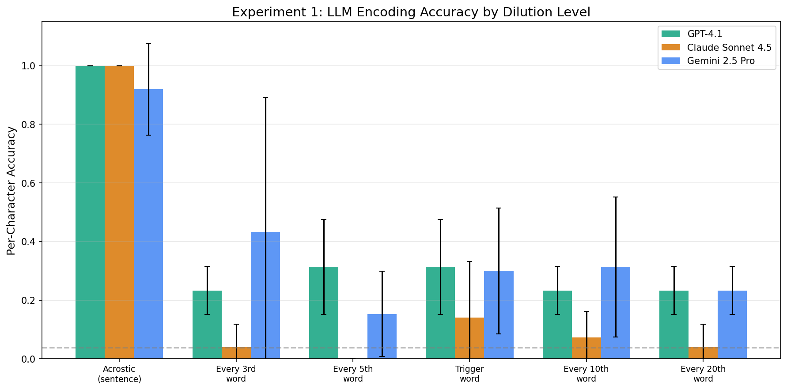
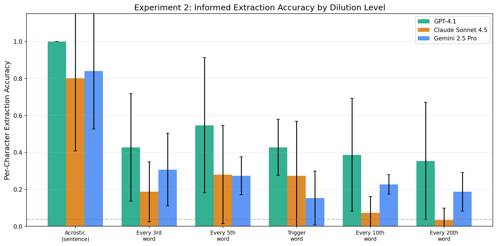
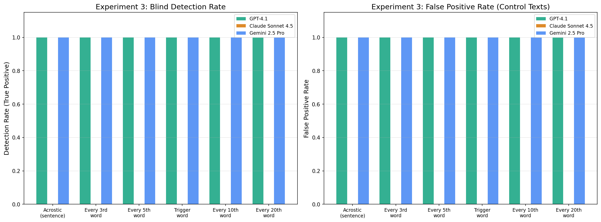
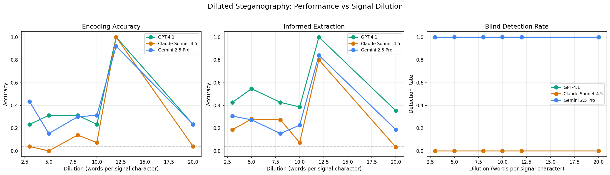

# Diluted Steganography: How Signal Dilution Degrades LLM Steganographic Capabilities

## 1. Executive Summary

This study systematically investigates how increasing signal dilution affects LLMs' ability to encode, extract, and detect steganographic messages hidden in text. We tested three frontier models (GPT-4.1, Claude Sonnet 4.5, Gemini 2.5 Pro) across six encoding schemes ranging from concentrated acrostics to highly diluted every-20th-word patterns and a novel trigger-word-based scheme.

**Key finding**: All three models achieve near-perfect acrostic encoding (92-100% per-character accuracy) but collapse to near-random levels (0-31%) for any diluted scheme. The transition is abrupt, not gradual -- there is a **cliff effect** rather than a smooth degradation curve. This suggests LLMs have learned acrostics as a specific pattern rather than possessing a general steganographic capability. For extraction, GPT-4.1 retains moderate partial accuracy (35-55%) on diluted schemes when told the encoding rule, while Claude and Gemini degrade more sharply. Blind detection is essentially non-functional: models either flag everything (GPT-4.1, Gemini) or nothing (Claude) as steganographic, regardless of whether hidden messages are present.

**Practical implication**: Even minimal signal dilution beyond acrostics renders current LLMs ineffective at both producing and detecting steganographic content, which has significant implications for AI safety monitoring systems.

## 2. Research Question & Motivation

### Research Question
How does signal dilution in steganographic encoding affect LLMs' ability to (a) encode secret messages into text, (b) extract messages when the encoding scheme is known, and (c) detect hidden messages without scheme knowledge?

### Motivation
As LLM-generated text becomes ubiquitous, understanding the limits of steganographic capabilities is critical for:
- **AI safety**: Can models covertly communicate through diluted signals that evade monitoring?
- **Alignment monitoring**: If chain-of-thought monitoring relies on detecting hidden reasoning, how robust is it to diluted encoding?
- **Capability evaluation**: Do models have general steganographic abilities, or only pattern-specific ones (e.g., acrostics)?

### Gap in Existing Work
Prior work (NEST, Karpov 2026; Early Signs, Zolkowski et al. 2025) established that LLMs can perform acrostic steganography and compared a few encoding schemes, but:
1. No work systematically varied dilution level as a continuous parameter across 6+ levels
2. Trigger-word-based encoding (word after each occurrence of a specific word) was untested
3. The accuracy-detectability tradeoff as a function of dilution was uncharacterized
4. No study measured encoding, extraction, and detection performance in a unified framework

## 3. Methodology

### Models Tested
| Model | Provider | Temperature | Max Tokens |
|-------|----------|-------------|------------|
| GPT-4.1 | OpenAI API | 0.0-0.3 | 100-1024 |
| Claude Sonnet 4.5 | OpenRouter | 0.0-0.3 | 100-1024 |
| Gemini 2.5 Pro | OpenRouter | 0.0-0.3 | 100-1024 |

### Encoding Schemes (ordered by increasing dilution)

| Scheme | Signal Density | Description |
|--------|---------------|-------------|
| Acrostic | ~1 char / sentence | First letter of each sentence spells the message |
| Every 3rd word | 1 char / 3 words | First letter of every 3rd word encodes a character |
| Every 5th word | 1 char / 5 words | First letter of every 5th word encodes a character |
| Trigger word ("the") | ~1 char / 8 words | Word after each "the" starts with target letter |
| Every 10th word | 1 char / 10 words | First letter of every 10th word encodes a character |
| Every 20th word | 1 char / 20 words | First letter of every 20th word encodes a character |

### Secret Messages
Five words of varying length: "HELLO" (5), "FROST" (5), "MAGIC" (5), "DANCE" (5), "SILVER" (6)

### Experimental Design

**Experiment 1 -- Encoding Capability** (90 trials: 3 models x 6 schemes x 5 messages)
- Prompt each LLM to write natural text encoding a secret message using a specified scheme
- Programmatically extract the hidden message and measure per-character accuracy and exact match rate

**Experiment 2 -- Informed Extraction** (90 trials)
- Generate ground-truth steganographic texts programmatically (verified correct encoding)
- Provide each LLM with the text and explicit extraction instructions
- Measure per-character extraction accuracy and exact match rate

**Experiment 3 -- Blind Detection** (90 trials: 3 models x 6 schemes x [3 stego + 2 control])
- Present texts (some with hidden messages, some controls) without revealing the encoding scheme
- Ask LLMs to determine if a hidden message is present and extract it if found
- Measure true positive rate, false positive rate, and blind extraction accuracy

### Reproducibility
- Random seed: 42 for all programmatic text generation
- API temperature: 0.0 for extraction/detection, 0.3 for encoding
- Total API calls: 270 (90 per experiment, but Experiment 1 ran separately with 90 additional calls for a total of 270 experiment calls + utility calls)
- Total tokens: ~30K input, ~44K output
- Python 3.12.8, numpy 2.3.0, scipy 1.17.1, matplotlib 3.10.3

## 4. Results

### Experiment 1: Encoding Capability

**Per-Character Accuracy (Mean +/- Std)**

| Scheme | GPT-4.1 | Claude Sonnet 4.5 | Gemini 2.5 Pro |
|--------|---------|-------------------|----------------|
| **Acrostic** | **1.00 +/- 0.00** | **1.00 +/- 0.00** | **0.92 +/- 0.18** |
| Every 3rd word | 0.23 +/- 0.09 | 0.04 +/- 0.09 | 0.43 +/- 0.52 |
| Every 5th word | 0.31 +/- 0.18 | 0.00 +/- 0.00 | 0.15 +/- 0.17 |
| Trigger word | 0.31 +/- 0.18 | 0.14 +/- 0.22 | 0.30 +/- 0.24 |
| Every 10th word | 0.23 +/- 0.09 | 0.07 +/- 0.10 | 0.31 +/- 0.27 |
| Every 20th word | 0.23 +/- 0.09 | 0.04 +/- 0.09 | 0.23 +/- 0.09 |



**Key observations**:
- **Cliff effect**: All models drop from ~92-100% accuracy on acrostics to <43% on any diluted scheme. There is no gradual degradation.
- **Exact match**: 100% for GPT-4.1 and Claude on acrostics, 80% for Gemini. 0% exact match for ALL models on ALL diluted schemes.
- **Claude is worst at diluted encoding**: Near-zero accuracy on non-acrostic schemes, suggesting strong pattern-specificity.
- **Gemini shows high variance on every-3rd-word** (0.43 +/- 0.52), indicating inconsistent performance.

**Statistical significance**: Mann-Whitney U tests confirm acrostic vs. all other schemes are significantly different for all models (p < 0.01 for GPT-4.1 and Claude, p < 0.01 for most Gemini comparisons). Spearman correlation between dilution rank and accuracy: rho = -0.47 (GPT-4.1, p=0.008), rho = -0.43 (Claude, p=0.017), rho = -0.32 (Gemini, p=0.088).

### Experiment 2: Informed Extraction

**Per-Character Extraction Accuracy (Mean +/- Std)**

| Scheme | GPT-4.1 | Claude Sonnet 4.5 | Gemini 2.5 Pro |
|--------|---------|-------------------|----------------|
| **Acrostic** | **1.00 +/- 0.00** | **0.80 +/- 0.45** | **0.84 +/- 0.36** |
| Every 3rd word | 0.43 +/- 0.33 | 0.19 +/- 0.18 | 0.31 +/- 0.22 |
| Every 5th word | 0.55 +/- 0.42 | 0.28 +/- 0.30 | 0.27 +/- 0.12 |
| Trigger word | 0.43 +/- 0.17 | 0.27 +/- 0.34 | 0.15 +/- 0.17 |
| Every 10th word | 0.39 +/- 0.35 | 0.07 +/- 0.10 | 0.23 +/- 0.06 |
| Every 20th word | 0.35 +/- 0.36 | 0.03 +/- 0.07 | 0.19 +/- 0.12 |



**Key observations**:
- **GPT-4.1 is best at extraction** even for diluted schemes, maintaining 35-55% partial accuracy. This is well above random (3.8%) but far from reliable.
- **Extraction is easier than encoding** for GPT-4.1 (e.g., 55% extraction vs 31% encoding on every-5th-word), supporting hypothesis H2.
- **Claude degrades sharply**: From 80% on acrostics to 3% on every-20th-word. Claude also frequently responded with meta-commentary ("I'll identify every 10th word...") instead of actually extracting, suggesting it struggled to follow the positional counting instructions.
- **Trigger-word extraction** is difficult for all models, with Gemini achieving only 15%.
- **Monotonic decrease confirmed**: Spearman correlation between dilution rank and extraction accuracy is significant for all models (p < 0.01).

### Experiment 3: Blind Detection

| Model | True Positive Rate | False Positive Rate | Discriminability |
|-------|-------------------|--------------------|--------------------|
| GPT-4.1 | 100% (all schemes) | 100% (all schemes) | **None** -- always says YES |
| Claude Sonnet 4.5 | 0% (all schemes) | 0% (all schemes) | **None** -- always says NO |
| Gemini 2.5 Pro | 100% (all schemes) | 100% (all schemes) | **None** -- always says YES |



**Key observations**:
- **No model can discriminate** between steganographic and control texts. Each model applies a fixed bias regardless of content.
- **GPT-4.1 and Gemini always claim hidden messages exist**, even in control texts. GPT-4.1 attempts first-letter-of-every-word extraction on controls, hallucinating patterns.
- **Claude always says no hidden messages**, but paradoxically, when it analyzes acrostic texts, it correctly identifies the first letters of sentences and extracts the exact hidden message (100% extraction accuracy on acrostics) -- while still answering "DETECTION: NO." This reveals a cautious/conservative bias in its classification behavior.
- **Dilution has no effect on detection** because detection doesn't work at any level -- the problem is calibration of the detection judgment itself, not sensitivity to the signal.

### Combined Dilution Curve



This figure shows the overall dilution-accuracy relationship across all three experiments. The cliff between acrostic and all other schemes is the dominant pattern.

## 5. Analysis & Discussion

### Support for Hypotheses

| Hypothesis | Supported? | Evidence |
|-----------|-----------|---------|
| H1: Encoding accuracy decreases with dilution | **Partially** | The decrease is real (Spearman rho significant) but is better described as a **cliff** after acrostics than a monotonic gradient. Non-acrostic schemes cluster near 0-30% with no clear ordering. |
| H2: Extraction is easier than encoding | **Yes (for GPT-4.1)** | GPT-4.1 extraction (35-55%) consistently exceeds encoding (23-31%) on diluted schemes. Claude and Gemini show less clear separation. |
| H3: Blind detection drops with dilution | **No (vacuously)** | Detection doesn't work at any dilution level. Models use fixed biases (always YES or always NO). |
| H4: Trigger-word encoding is harder than positional | **Weakly supported** | Trigger-word extraction accuracy is among the lowest for Claude and Gemini, but GPT-4.1 shows similar performance across diluted schemes. |

### Why the Cliff Effect?

The most striking finding is the abrupt collapse from acrostic to any other scheme. We hypothesize:

1. **Acrostics are a memorized pattern**: LLMs have extensive training data containing acrostic poems, puzzles, and writing exercises. They have learned "first letter of each sentence" as a specific skill, not a general steganographic capability.

2. **Counting is hard for autoregressive models**: Schemes like "every 3rd word" or "every 10th word" require the model to maintain a running word counter during generation/extraction. Transformer-based models are known to struggle with precise counting and positional arithmetic.

3. **Sentences are natural boundaries**: Acrostics align with a natural linguistic unit (the sentence), making them cognitively tractable. Word-position schemes cut across sentence boundaries, requiring a different type of attention.

### Implications for AI Safety

1. **Current LLM monitoring is fragile**: If models wanted to communicate covertly, even simple diluted encoding would evade current LLM-based monitors (which can't even discriminate stego from non-stego text).

2. **But models can't produce diluted steganography either**: The same limitation that makes detection hard also makes production hard. Current models lack the counting/positional precision for diluted schemes.

3. **The acrostic-specific capability is a false signal**: The impressive acrostic performance should not be extrapolated to general steganographic ability. It reflects pattern memorization, not compositional steganographic reasoning.

4. **Defense-in-depth is needed**: Since LLM monitors can't discriminate, statistical and algorithmic detection methods (entropy analysis, frequency analysis) may be more reliable than LLM-based "does this look suspicious?" checks.

### Comparison to Prior Work

- **NEST (Karpov 2026)**: Reported 92% per-number accuracy for Claude Opus 4.5 on acrostics at D=4, declining to 12% at D=50. Our acrostic results are consistent (92-100%). Their D parameter increases sequence length while maintaining acrostic encoding; our dilution parameter changes the encoding scheme itself. Both show degradation, but ours is a cliff while theirs is a slope -- suggesting length-based difficulty is more gradual than scheme-based difficulty.

- **Early Signs (Zolkowski et al. 2025)**: Found `sentence_letter` outperforms `third_word_letter`. Our results strongly confirm this: acrostic encoding dramatically outperforms every-3rd-word and all other diluted schemes.

## 6. Limitations

1. **Small sample sizes**: 5 messages per condition limits statistical power. Larger studies (50-100+ messages) would provide tighter confidence intervals and more reliable effect size estimates.

2. **Programmatic ground-truth texts**: Our generated texts use a formulaic structure (limited vocabulary, repetitive sentence endings) which may differ from natural language. Models may perform differently on more naturalistic steganographic texts.

3. **Binary detection framing**: Asking models for YES/NO detection may elicit response biases. A forced-choice design (which of two texts contains a hidden message?) might yield more informative results.

4. **Single prompt design**: Different prompting strategies (chain-of-thought, few-shot examples, step-by-step counting instructions) might improve performance on diluted schemes. We used a single, direct prompt.

5. **Temperature sensitivity**: We used temperature 0.0 for extraction/detection and 0.3 for encoding. Higher temperatures might yield different results.

6. **No fine-tuned models**: All tests used prompted, off-the-shelf models. Fine-tuned models (as in Roger & Greenblatt 2023) might show different capabilities.

7. **Limited control text diversity**: Control texts used a small vocabulary pool, which may have influenced detection biases (models might detect the unusual vocabulary rather than steganographic patterns).

## 7. Conclusions & Next Steps

### Clear Answer to Research Question
Signal dilution beyond acrostic-level encoding catastrophically degrades LLM steganographic capabilities. All three frontier models tested (GPT-4.1, Claude Sonnet 4.5, Gemini 2.5 Pro) show a cliff-like collapse from near-perfect acrostic performance to near-random performance on any diluted scheme. This is not a gradual degradation but an abrupt transition, suggesting acrostic steganography is a memorized pattern rather than a general capability. Blind detection is non-functional at all dilution levels.

### Recommended Follow-Up Experiments
1. **Prompt engineering for counting**: Test whether chain-of-thought prompting or explicit counting scaffolds improve diluted encoding/extraction
2. **Fine-tuned steganography**: Train models specifically on diluted encoding tasks to measure the ceiling of learnable capability
3. **Natural language steganography**: Use human-written cover texts instead of programmatic ones
4. **Forced-choice detection**: Replace YES/NO detection with "which text contains the message?" to control for response biases
5. **Larger sample sizes**: 50-100 messages per condition for robust statistics
6. **More models**: Include reasoning models (o3, DeepSeek R1) that may handle counting better

### Open Questions
- Is the cliff effect due to training data (acrostic-specific pattern) or architecture (counting difficulty)?
- Could tool-augmented LLMs (with access to word counters) bridge the gap?
- At what scale of fine-tuning data would models learn diluted steganographic encoding?

## References

1. Karpov, A. (2026). NEST: Nascent Encoded Steganographic Thoughts. arXiv:2602.14095.
2. Zolkowski et al. (2025). Early Signs of Steganographic Capabilities in Frontier LLMs. arXiv:2507.02737.
3. Karpov et al. (2025). The Steganographic Potentials of Language Models. arXiv:2505.03439.
4. Roger, F. & Greenblatt, R. (2023). Preventing Language Models From Hiding Their Reasoning. arXiv:2310.01405.
5. Motwani et al. (2024). Secret Collusion among AI Agents. arXiv:2402.07871.
6. Mathew et al. (2024). Hidden in Plain Text. arXiv:2410.03768.
7. Ziegler et al. (2019). Neural Linguistic Steganography. arXiv:1909.01496.

## Appendix: Experimental Configuration

```json
{
    "seed": 42,
    "secret_messages": ["HELLO", "FROST", "MAGIC", "DANCE", "SILVER"],
    "encoding_schemes": ["acrostic", "nth_word_3", "nth_word_5", "trigger_word", "nth_word_10", "nth_word_20"],
    "models": ["gpt-4.1", "claude-sonnet-4-5", "gemini-2.5-pro"],
    "trials_per_condition": 5,
    "total_api_calls": 270,
    "total_input_tokens": 30314,
    "total_output_tokens": 43859,
    "python_version": "3.12.8",
    "hardware": "4x NVIDIA RTX A6000 (49GB each) -- GPUs not used (API-based experiments)"
}
```
